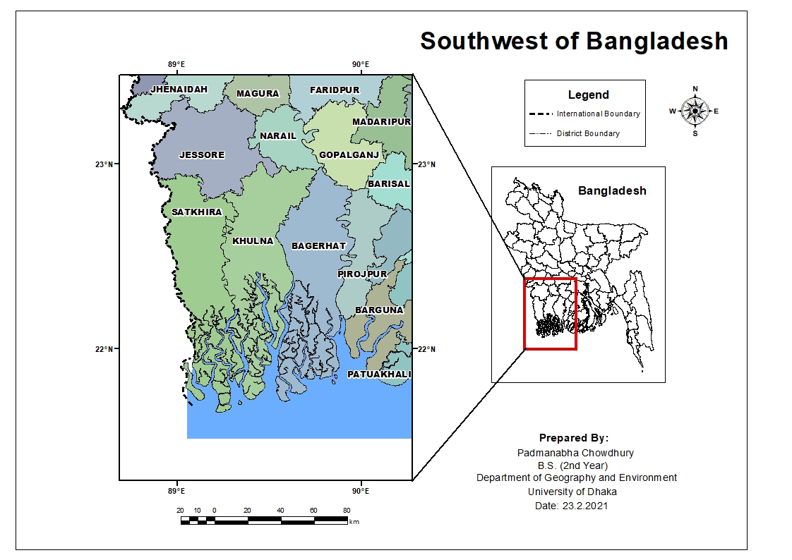

# Cartography Portfolio
I have been making maps since 2020. Whatever the purpose, I enjoy creating maps. 

## Schools and Colleges in Dhaka, Bangladesh
My first map that I shared publicly on December, 2020. I have shared the process of making the map on a <a href="https://www.linkedin.com/pulse/my-data-driven-december-padmanabha-chowdhury/"> LinkedIn</a> article.
 

## Southwest of Bangladesh
This map is a part of a research that was presented on the 8th International Conference on Water and Flood Management, BUET, 2021. The title of our paper was IMPACTS OF CLIMATE CHANGE ON THE AVAILABILITY OF SAFE DRINKING WATER AND RESULTING HEALTH HAZARDS IN SOUTHWESTERN PART OF BANGLADESH: A REVIEW. The abstract of the paper can be found on the <a href="https://drive.google.com/file/d/1MPYkSuARv8J6baHb1necMPejE1E4eDLD/view"> Book of abstracts</a> (page: 237).
 

## 30DayMapChallenge
I have created a separate repository for this section.
<ul>
  <li><a href="https://github.com/GOItPadma/30DayMapChallenge-2021"> 30DayMapChallenge-2021</a></li>
</ul>
